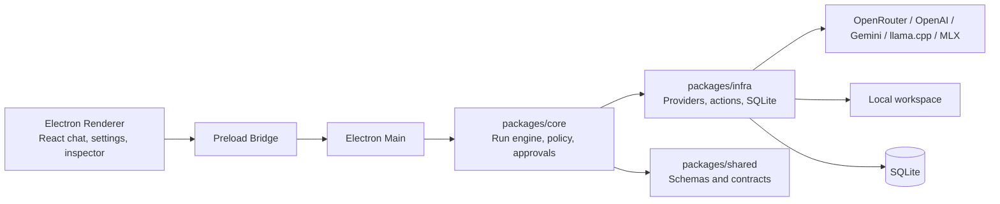

# Nano Harness

`nano-harness` is a personal, local-first coding harness for working with AI providers under controlled autonomy. It gives you a desktop chat workspace where an assistant can plan, inspect code, make approved changes, run validation, and leave behind a clear trace of what happened.

Nano is intentionally small and opinionated. It is not a marketplace or a general agent platform; it is a local app for one owner who wants useful coding automation without losing visibility or control.

Status: pre-release learning project. It is useful as a local desktop experiment, but it is not production-ready and is not intended to be a hosted multi-user agent platform.

## Providers

Nano can route runs through hosted and local model providers:

| Provider | Auth | Endpoint | Why It Matters |
| --- | --- | --- | --- |
| **OpenRouter** | API key | OpenAI-compatible | Quickly try many hosted models through one adapter. |
| **OpenAI** | ChatGPT subscription auth | ChatGPT subscription provider | Use OpenAI models without storing a separate API key. |
| **Google Gemini** | Google AI Studio API key | Gemini API | Run Gemini models from the same harness workflow. |
| **llama.cpp** | None by default | Local OpenAI-compatible server | Test local GGUF models without leaving the app. |
| **MLX** | None by default | Local OpenAI-compatible server | Run local Apple Silicon models through the same interface. |

This makes it easy to compare hosted models with local models inside the same chat, approval, and run-inspection workflow.

## What It Does

- Connects to configurable AI providers for streamed assistant runs.
- Lets the assistant inspect a workspace, search files, propose patches, and run approved commands.
- Keeps risky actions behind approvals and workspace boundaries.
- Shows an inspectable timeline of messages, tool calls, approvals, events, and validation output behind the Advanced toggle.
- Supports simple Plan, Build, and Review chat sessions.
- Keeps more experimental surfaces deferred behind renderer feature flags.

## Why It Exists

- Local-first: your conversations, settings, approvals, and run evidence stay on your machine.
- Inspectable: the assistant's work is visible through events, approvals, and exports.
- Provider-flexible: use hosted or local providers through small adapters.
- Focused: advanced capabilities can exist locally without taking over the main chat UI.
- Personal: defaults and workflows are optimized for a single owner, not a large platform.

## Why I Built This

I built Nano to understand what an AI coding harness looks like under the hood when the abstractions stop being buzzwords. A run has provider calls, tool calls, policy checks, approvals, events, persistence, and validation obligations. Building the small version made those seams concrete.

The goal was not to beat mature coding tools. It was to learn the shape of the system and keep the result small enough to inspect.

## Architecture



The important runtime primitive is the run: a bounded attempt to satisfy one user request. Runs collect messages, provider requests, action invocations, policy decisions, approvals, events, and persisted evidence.

## Try It Locally

Install dependencies:

```bash
pnpm install
```

Start the desktop app in development:

```bash
pnpm dev
```

Then:

- Open Settings and choose a provider.
- Use an OpenRouter or Google API key, sign in with ChatGPT subscription auth for OpenAI, or point the app at a local llama.cpp/MLX OpenAI-compatible server.
- Pick Plan, Build, or Review in the composer.
- Toggle Advanced to inspect run events, approvals, validation state, and evidence export.

## What I Learned

- The useful abstraction is the run, not a vague agent object.
- Tool calls are contracts, inputs, execution boundaries, policy decisions, and results.
- AI makes code cheaper to produce, which makes architecture boundaries more important, not less.
- Local models are increasingly useful for bounded coding tasks when the workflow and context are clear.
- Inspectability is a product feature: events, approvals, and exports make the assistant's work reviewable.

## Workspace

- `apps/desktop`: Electron main process, preload bridge, and React renderer.
- `packages/core`: orchestration runtime, run engine, policy, approvals, hooks, roles, and dry-run preview.
- `packages/infra`: provider adapters, SQLite persistence, built-in actions, skills loading, MCP adapters, and other side effects.
- `packages/shared`: shared Zod schemas, bridge contracts, settings, events, runs, memory, skills, MCP, and spec/harness artifacts.
- `benchmarks`: tracked regression scenarios for agent behavior, safety, and evidence quality.

## Intentionally Unfinished

The current app is optimized for a usable basic chat workflow. Several bigger ideas are present in the codebase but hidden by default through `apps/desktop/src/renderer/features.ts` because they need more product work before they should be part of the main experience:

- Spec Workbench routes, composer mode, artifact panels, and evidence panels.
- Skills settings and skill drafting UI.
- MCP settings and resource/tool surfacing.
- Memory settings and run-level memory review surfaces.
- Harness self-improvement, benchmark promotion, and component registry UI.
- Session fork, clone, export, and compaction UI.

See `TODO.md` for the current deferred-feature list and the planned right-sidebar refactor.

## Testing

Run the main checks:

```bash
pnpm test
pnpm test:e2e
pnpm typecheck
pnpm lint
pnpm --filter @nano-harness/desktop check:styles
```

- `pnpm test` covers shared/core/infra packages plus desktop main, preload, and renderer behavior.
- `pnpm test:e2e` covers renderer smoke flows with a mocked desktop bridge.
- `pnpm --filter @nano-harness/desktop check:styles` guards renderer component CSS against raw design values and non-scalable sizing regressions.
- The Vite renderer alone does not include the Electron preload bridge, so browser-only checks and tests may mock `window.desktop`.

Note: run `pnpm exec playwright install chromium` on first-time setup or after Playwright upgrades.

## Packaging

Package the desktop app:

```bash
pnpm pack:mac
pnpm dist:mac
pnpm pack:win
pnpm dist:win
pnpm pack:linux
pnpm dist:linux
```

- `pnpm pack:mac` creates an unpacked app bundle for local verification.
- `pnpm dist:mac` creates a macOS disk image.
- `pnpm pack:win` and `pnpm dist:win` build Windows NSIS targets.
- `pnpm pack:linux` and `pnpm dist:linux` build Linux AppImage targets.
